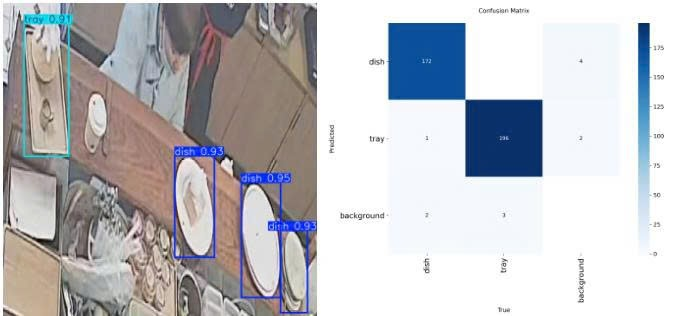
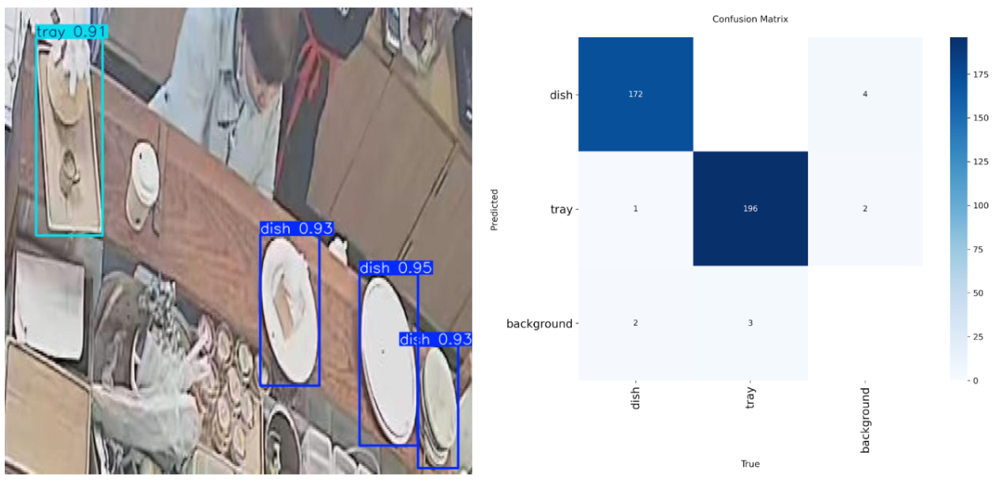

`DEMO WEB + YOLO`





## Project Structure

Below is the directory tree structure of the project along with a detailed explanation of each component's role and relationships.

```
.
├── src/
│   ├── app/
│   │   ├── globals.css      # Global CSS file, containing Tailwind/ShadCN color variables and theme.
│   │   ├── layout.tsx       # Root layout of the application, wrapping all pages.
│   │   └── page.tsx         # Main page component (homepage), the application's entry point.
│   │
│   ├── components/
│   │   ├── ui/              # Contains user interface components from the ShadCN library (Button, Card, etc.).
│   │   └── video-stream-deck.tsx # Main component containing all the application's logic and UI.
│   │
│   ├── ai/
│   │   ├── genkit.ts        # Genkit configuration and initialization file, connecting to Google AI services.
│   │   └── dev.ts           # File used to run Genkit in a development environment.
│   │
│   ├── hooks/
│   │   ├── use-mobile.tsx   # Custom hook to detect if the device is mobile.
│   │   └── use-toast.ts     # Hook to manage and display notifications (toasts).
│   │
│   └── lib/
│       └── utils.ts         # Contains utility functions, e.g., the `cn` function for combining CSS classes.
│
├── next.config.ts           # Configuration file for Next.js (e.g., image configuration, build,...).
├── package.json             # Lists package dependencies and scripts (dev, build, start).
├── tailwind.config.ts       # Configuration file for Tailwind CSS (e.g., font definitions, colors, plugins).
└── tsconfig.json            # TypeScript configuration file, defining rules for the compiler.
```

### Detailed Explanation:

  * **`src/app/`**: This is the core of the application following Next.js's App Router architecture.

      * `layout.tsx` defines the general HTML structure (e.g., `<html>`, `<body>` tags, fonts) for the entire website. It wraps `page.tsx`.
      * `page.tsx` is the main content of the homepage. It uses the `VideoStreamDeck` component from `src/components/`.
      * `globals.css` defines global styles and HSL color variables for the theme. `tailwind.config.ts` and components in `src/components/ui/` all utilize these variables.

  * **`src/components/`**: This is where the application's UI building blocks are located.

      * `ui/`: Basic components, pre-built by ShadCN, help in quickly and consistently building the interface.
      * `video-stream-deck.tsx`: This is the "smart component," where most of the application's business logic is concentrated: managing video state, handling events, user interaction, and displaying data. It heavily uses components from `ui/`.

  * **`src/ai/`**: This directory is dedicated to Artificial Intelligence (AI)-related functionalities.

      * `genkit.ts` is a crucial file for setting up connections to AI models (like Gemini). Future AI flows will import the `ai` object from this file.

  * **`src/hooks/` & `src/lib/`**: Contains reusable code across the application.

      * `hooks/`: Contains custom React Hooks to encapsulate and reuse stateful logic.
      * `lib/`: Contains pure utility functions, independent of React.

  * **Root-level Configuration Files**:

      * `package.json`: The "heart" of a Node.js project, managing external libraries.
      * `next.config.ts`, `tailwind.config.ts`, `tsconfig.json`: These files define how Next.js, Tailwind CSS, and TypeScript operate, helping customize the build and development process.

-----

## Installation and Running the Project

Follow the steps below to install and run the project on your personal computer.

### 1\. Download the Project from GitHub

Open Command Prompt (CMD) or Terminal and use the `git clone` command to copy the repository to your machine. Replace `URL_REPOSITORY` with the SSH or HTTPS path of the repository on GitHub.

```bash
git clone <URL_REPOSITORY>
```

Then, navigate into the newly downloaded directory:

```bash
cd <PROJECT_DIRECTORY_NAME>
```

### 2\. Install Necessary Libraries

In the project's root directory, run the following command to install all libraries defined in the `package.json` file:

```bash
npm install
```

This command will download and install dependencies such as React, Next.js, Tailwind CSS, ShadCN, Genkit, etc.

### 3\. Run the Application (Development Environment)

After successful installation, use the following command to start the development server:

```bash
npm run dev
```

Your application will run at `http://localhost:9002` (or a different port if port 9002 is already in use). Open your browser and access this address to view the web page.

### 4\. Run the Project with Docker (Production Environment - Recommended)

This method will launch both the web application (Next.js) and the AI service (Python/Flask) in separate containers, ensuring a consistent operating environment isolated from your computer.

**Requirements:**

  * [Docker](https://www.docker.com/get-started) installed on your machine.
  * [Docker Compose](https://docs.docker.com/compose/install/) (usually comes with Docker Desktop).

**Steps:**

1.  **Build and Run Containers:**
    Open CMD or Terminal from the project's root directory and run the following command:

    ```bash
    docker-compose up --build
    ```

      * The `docker-compose up` command will locate the `docker-compose.yml` file, then build and start the services (`web` and `api`) defined within it.
      * The `--build` flag will instruct Docker to rebuild the image from scratch if there are any changes in the `Dockerfile` or source code, ensuring you always run the latest version.

2.  **Access the Application:**
    After the containers successfully start, you can access the web application at: `http://localhost:9002`.
    The API service will run in the background and will be automatically called by the web application.

3.  **Stop the Application:**
    To stop the containers, press `Ctrl + C` in the running terminal. To remove the created containers and networks, you can run:

    ```bash
    docker-compose down
    ```