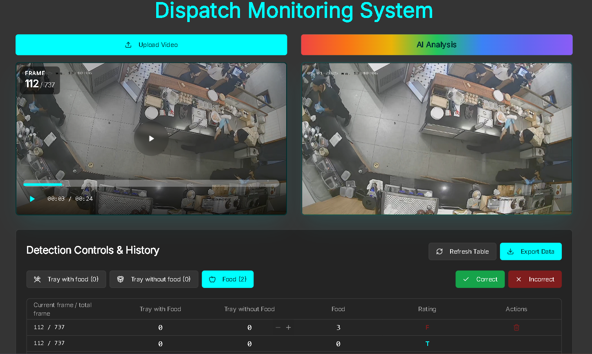

# Project Development and Deployment Process with Docker Compose

# A. Model ML
 - As for CNN models for detection. I used YOLO for detection purpose which I trained on my personal Colab. Because YOLO quite light and very good real-time processing

 

 - And 6 class classification model. Trained with Teachable Machine (Google) CNN architecture. (Because used it with high accuracy) 

# B. Project

(current)

## 1. Project Initialization

- **Requirement Analysis:** Gather and document all project requirements.
- **Tech Stack Selection:** Choose technologies (e.g., Python, FlaskAPI, Pytorch, html, css).
- **Repository Setup:** Initialize a Git repository and set up the project structure.

## 2. Local Development
- **Languages & Platforms Used:**  
   - **Python:** Main backend logic, model inference, and API (Flask).
   - **HTML/CSS/JavaScript:** Frontend web interface.
   - **Docker & Docker Compose:** Containerization and orchestration.
   - **PyTorch:** Deep learning framework for ML models.
   - **Node.js:** (If used) For frontend tooling or additional services.
- **Service Definition:** Create `Dockerfile` shared.
- **Docker Compose Configuration:** Write a `docker-compose.yml` to orchestrate all services.
- **Development Workflow:**
   - Use `docker-compose up` to start all services.
   - Develop features, commit changes, and push to the repository.

## 3. (Come here) Testing

- **Unit and Integration Tests:** Write and run tests locally.
- **Automated Testing:** Configure test scripts in the repository.

## 4. Preparing for Deployment

- **Environment Variables:** Use `.env` files for configuration.
- **Production Dockerfiles:** Optimize Dockerfiles for production (multi-stage builds, smaller images).
- **Docker Compose for Production:** Create a separate `docker-compose.prod.yml` if needed.

## 5. CI/CD Pipeline Setup

- **CI/CD Tool Selection:** Choose a platform (e.g., GitHub Actions, GitLab CI, Jenkins).
- **Pipeline Configuration:**
   - **Build Stage:** Build Docker images for all services.
   - **Test Stage:** Run automated tests.
   - **Push Stage:** Push images to a container registry (e.g., Docker Hub).
   - **Deploy Stage:** Deploy to the production server.

## 6. Deployment to Website

- **Server Preparation:** Provision a VPS or cloud server (AWS, Azure, DigitalOcean).
- **Install Docker & Docker Compose:** Ensure Docker and Docker Compose are installed on the server.
- **Clone Repository:** Pull the latest code from the repository.
- **Environment Configuration:** Set up production `.env` files.
- **Start Services:** Use `docker-compose -f docker-compose.prod.yml up -d` to start services in detached mode.
- **Domain & SSL:** Configure domain and SSL certificates (e.g., with Nginx and Let's Encrypt).

## 7. Continuous Deployment

- **Automated Deployment:** Configure the CI/CD pipeline to automatically deploy on new commits to the main branch.
- **Monitoring & Logging:** Set up monitoring (e.g., Prometheus, Grafana) and logging (e.g., ELK stack).

## 8. Maintenance

- **Update Images:** Rebuild and redeploy Docker images for updates.
- **Backup:** Regularly back up databases and important data.
- **Security:** Keep dependencies and Docker images up to date.

---

This process ensures efficient development, testing, and deployment of your project using Docker Compose and CI/CD, enabling reliable and scalable web deployments.